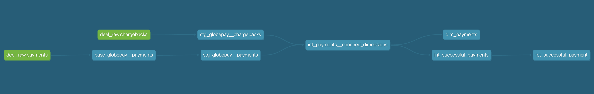

# Analytics Engineer Coding Exercise

Hi there! Thanks for reviewing this technical test and sharing your feedback. I will try to walk you through the decisions and reasoning
I made to come up with the structure of this dbt project.


## Preliminary data exploration

- There are two datasets, one for charge acceptances and another one for chargebacks. The primary key for the `charge_acceptance` table is named `ref`, while for the `chargebacks` table is the `external_ref` column. Chargebacks can be related to their charge through the `external_ref` field, which is unique in both datasets.

- `status` and `source` columns have the same values for all records. Apparently, they can be ignored in the transformation as they’re not providing relevant information.

- The `amount` for charges will need to be standardized to USD, using the currency and the rates fields. This should happen in the staging layer, so every model downstream using amounts will already have it standardized.

- Timestamps are in UTC, and will keep them like that.

- The column `state` from charges can take two values ‘ACCEPTED’ and ‘DECLINED’, this will be an important dimension to filter analysis.

- There’s nothing indicating the need of excluding records (tests, duplicates).

## Implementation Details

This is a very straightforward implementation of a dbt project. The configuration is intentionally kept simple to allow
for easy setup and to focus on the development process itself.

While this approach is effective for smaller-scale use cases or local environments, I am aware that there are more scalable solutions for deploying dbt projects in production, such as containerizing the environment using Docker, Okteto, etc. These options offer better dependency management, scalability, and portability.

For the purposes of this test, I opted for a simpler approach to prioritize clarity and ease of review, while still reflecting best practices in terms of dbt model structuring, naming, data quality and code style.

Most of the decisions made here are debatable and the implementation would naturally evolve with a deeper understanding of the reporting needs and with wider data sources.

### About dbt set-up
#### What you need to make this project work
- Install dbt core and the Postgres adapter on your machine. You'll also need to install the `dbt_utils` package. 
Remember to run `dbt-deps` once the package is installed.
- Create a local Postgresql database named `deel_raw` and load the `.csv` files.
- Use the `profiles_example.yml` to create your own `profiles.yml` file with the settings of the database you created in the previous step.

#### Considerations on improving the set-up
- Using different profiles for dev and prod and storing the credentials and all sensitive information in a `.env file`,
from where the values can be mapped to the `profiles.yml` file. Such `.env` file should be included in the `.gitignore` file.
Having independent environments will allow developers to write in a separate database/schema from production, with their own roles, reducing the risk of mistakenly alter the production pipeline and databases.

Another advantage of seprating both environments is limiting the data modeled in development, it can reduce processing costs in the warehouse and reduce development time as well.

- Containerize the environment set up, so it's reproducible along the developers team and production. The container could include the
installation of dbt core, the database adapter and packages. Also, a makefile could be created to condense the most commonly used dbt commands and their configurations. For example the `--profiles-dir` flag mentioned before should be automated this way, so developers don't need to enter it everytime.
- Something useful and pretty simple to implement is a PR template. This eases the reviewing process and helps developers allign on the checklist to consider a PR submit ready to review.
-  Setting a proper CI/CD pipeline to automate code-quality checks, data lineage validation, deployment to production, among many more usecases.
- Lastly, implementing a data observability tool such us Elementary, Montecarlo or any other package that heps automating the identification and fix of data quality issues.

## Data lineage - model architecture



### Staging

Materialized as views, staging models have a 1:1 relationship to sources and are primarly used for renaming. When necessary, casting and conversions should be implemented in these models as well. When a claning step is needed, to remove test data for instance, I'd implement a cleaning subfolder inside staging and place those models as parents of the staging ones.

If the data volume is too high, this could be materialized as table.

I decided not to document every column, but instead leave it to the `marts` folder. However, I do test what is expected to be primary keys. This is helpful when debugging, a fast check is looking for duplicates in `marts` models and their parent `staging` ones, to see if the duplicates are more likely to come from the raw soure or were generated during transformation in `marts` or `int` steps.

I opted to leave a select * at the end of each stg model so that, if a field is needed in a marts model, it can be added easily.

### Intermediate

Materialized as ephemeral, this folder is used to perform more complex transformations, such as applying business logic or filtering, joining different entities or joining models before exposing to the final marts models, etc.

Here I used a naming conversion like `int_<entity>__<transofrmation>`, in which the entity and the action performed by the model are separated by two
underscores.

For documentation, I only added a short description of what the model does. This is helpful as these model are ephemeral.

### Marts

Materialized as tables, this layer is used for reporting.
All the columns in marts models are documented to make definitions accessible and enable users to self-serve as much as possible.

In case of not having a native primary key, a surrogate key could be created using the `dbt_utils` package.

The fields to expose in the final select of marts models are explicitly stated.
This is helpful to keep only relevant data and avoid ambiguous references when querying the data and performing joins.

This folder is splitted by business domains to keep it in order while more models are added. So, at the same level of the finance folder we could have
anothe called `sales` or `marketing`

For this exercise, there are two `dim` and one `fct` models. `fct_successful_payment` will contain a subset of the payments in `dim_payments`, where all the payments will be found, along with their attributes.

To answer the  analyst's questions, I'd suggest this:
1. Compute acceptance rate over time:

Use `dim_payments` to count all payments and the successful ones, aggregated by the time period you're interested in.

This query can help

```
with total_payments as (

	select
		date_trunc('month', payment_datetime_utc)::date _month,
		count(*) as total_payments
	from dbt_marts_finance.dim_payments
	group by 1
	
),
	
accepted_payments as (

	select
		date_trunc('month', payment_datetime_utc)::date _month,
		count(*) as accepted_payments
	from dbt_marts_finance.dim_payments
			where state = 'ACCEPTED'
	group by 1
	
)
	
select *,
	
(accepted_payments::numeric(7, 2)/total_payments::numeric(7, 2)* 100) as acceptance_rate
	
from total_payments
left join accepted_payments using (_month);

```

2. List the countries where the amount of declined transactions went over $25M:

Use `dim_payments`, sum the `payment_amount_usd` field, filtering only payments with `state='DECLINED'` and group them by country

````
select 
	country, 
	sum(payment_amount_usd) as declined_amount_usd
from dbt_marts_finance.dim_payments
where state = 'DECLINED'
group by 1
having sum(payment_amount_usd) > 25000000
order by 2 desc;

````

3. Spot transactions with missing chargeback data

Use `dim_payments.has_chargeback`. If the field is null, it means the chargeback data is missing.

### Jinja & Macros

Jinja & Macros are useful to avoid repeating the same code in multiple places. Since this project is quite simple, implementing a macro didn't seem to be necessary.

However, using Jinja to avoid hard-coding a case statement to convert the amounts in payments according to their currency, comes handy and is also easy to read. 